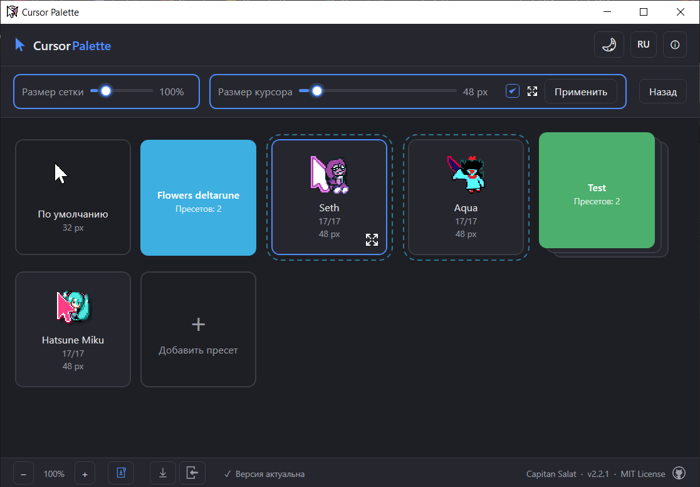
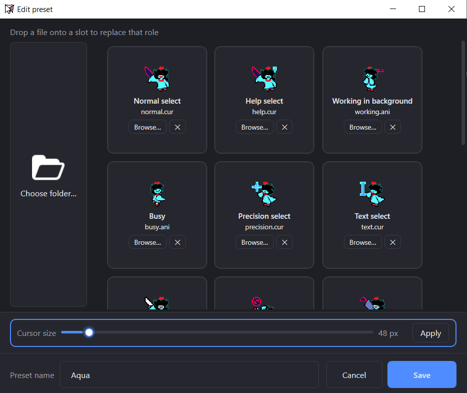
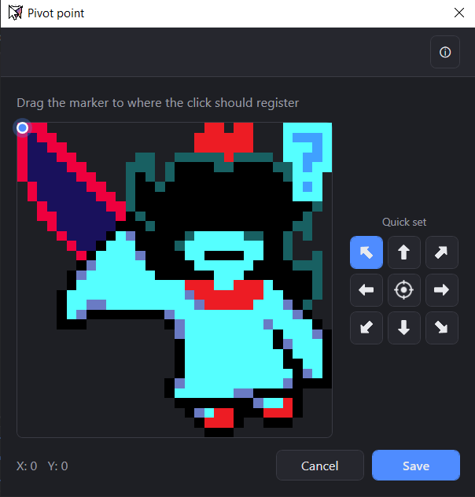
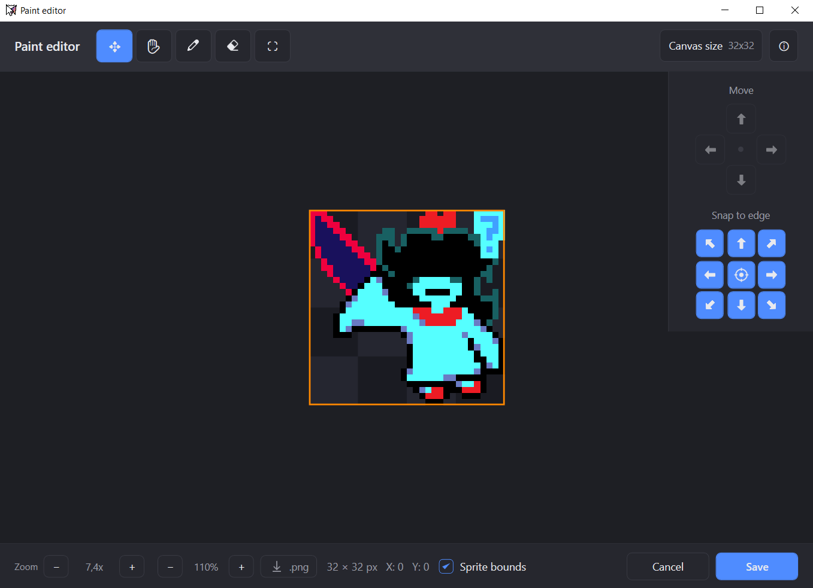
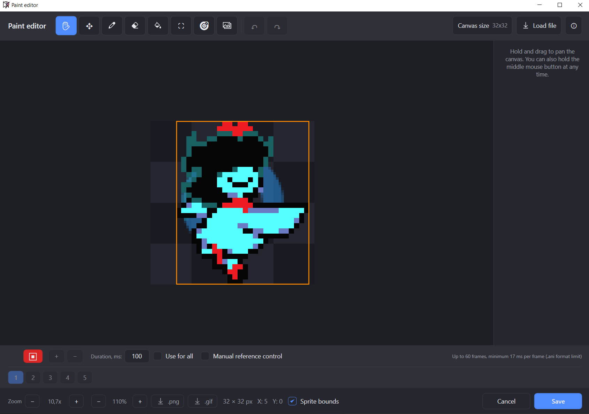
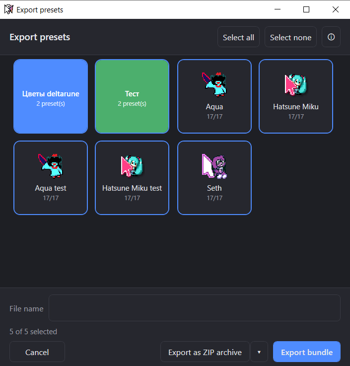

# Cursor Palette

A lightweight Windows app for applying mouse cursor presets visually, in a
single click — no digging through system settings by hand.

Built with a focus on **simplicity, minimalism, and ease of use**: a single
screen, no unnecessary settings — just a gallery of presets and instant
apply.

## Features

- **Preset gallery** — every saved preset is shown as a tile with a preview,
  name, number of filled roles, and cursor size.
- **One-click apply** — clicking a tile instantly changes the cursor
  system-wide via the Windows registry and `SystemParametersInfo`.
- **Create and edit presets** — drag and drop `.cur`/`.ani` files onto the
  slot for the role you want (Arrow, Wait, IBeam, Hand, etc. — 17 system
  cursor roles in total), or pick files manually.

  

- **Drag-and-drop from the desktop** — drop files, a folder, or a `.zip`/
  `.rar`/`.7z` archive of cursors straight onto the main window to create a
  new preset right away (the preset name is picked up automatically from the
  folder/archive name); the same works inside the "Choose folder" area of the
  preset editor. A dashed outline highlights exactly where the item you're
  dragging can be dropped.
- **Pivot point editor** — drag the marker on an enlarged preview to set
  exactly where clicks register for that cursor, or snap it to a corner,
  edge, or center with one click on the 3×3 quick-set pad (it lights up
  when the current position matches a preset). Works for both `.cur` and
  every frame of a `.ani`.

  
- **Paint editor** — edit a cursor's artwork pixel by pixel, right from a
  slot in the preset editor (including empty slots, to draw one from
  scratch). Move the sprite by dragging it or with the arrow/snap-to-edge
  pad, pan around with the Hand tool or by holding the middle mouse
  button, and zoom in for pixel-level precision on small cursors. The
  Canvas tool shows resize handles on the canvas edges/corners and only
  applies the new size once you confirm — switching tools without
  confirming reverts it. Export the result as a `.png` (named after the
  preset and cursor role) or save it back into the slot.

  

  - **Brush, Eraser, and Fill** — paint or erase pixels by dragging, with a
    Shift+click straight-line mode (Ctrl snaps to 45°); Fill floods a
    same-colored area with the selected color.
  - **Color picker** — toggle between a color wheel and a Photoshop-style
    square, adjust hue/brightness/alpha, or type/paste a hex code
    directly.
  - **Eyedropper** — sample a color from anywhere on screen, not just the
    canvas, via a dedicated button or Alt+click while painting/filling.
  - **Undo/redo** (Ctrl+Z / Ctrl+Y) covering painting, erasing, filling,
    moving, resizing the canvas, and importing an image.
  - **Hotspot tool** built into the Paint editor — drag the marker or click
    the desired spot, with the same 9-button quick-set pad as the
    standalone pivot editor.
  - **Background reference** — overlay a semi-transparent tracing image
    behind the sprite (opacity, margin, and offset adjustable, or load
    your own PNG/drag one onto the canvas); it's a guide only and isn't
    saved into the cursor.
  - **Import an image onto the canvas** — load a `.png`/`.jpg`/`.bmp`/`.gif`
    (or `.cur`/`.ani`) via a button or drag-and-drop, either composited
    over the current sprite (canvas grows to fit) or replacing it
    entirely. Dropping a multi-frame GIF turns it straight into an
    animated cursor: every GIF frame becomes a timeline frame, with
    disposal and per-frame delay handled automatically.
  - The last tool, zoom, pan position, color, and picker mode are all
    remembered between sessions. The width of the right-hand tool panel
    is resizable by dragging the splitter and is remembered too.
  - **Animation timeline** — draw a `.cur` into an animated `.ani` cursor
    right inside the editor: add/remove frames, scrub between them, set a
    per-frame duration, and play/stop a live preview (up to 60 frames,
    17 ms minimum per frame — the `.ani` format's own limit). Saving with
    more than one frame writes a real `.ani` file; a single frame still
    saves as a plain `.cur`, unchanged. The background reference panel
    gains matching controls: a "hide main image" toggle to see the
    reference on its own, and — for an animated reference — its frame
    follows the timeline automatically, or can be browsed independently
    via a "manual reference control" switch. The finished animation can
    also be exported straight to `.gif`, next to the existing `.png`
    export.

    
- **Animated `.ani` preview** — animated cursors (busy, working, etc.) play
  their full frame sequence with original timing in the gallery and preset
  editor, instead of a static first frame.
- **Cursor size per preset** — a slider controls the system cursor size
  (32–256 px), stored separately for each preset and for the default tile.
  Scaling is enabled by default for new presets; a small icon on each cell
  indicates whether scaling is active.
- **Reset to Windows defaults** — a dedicated "Default" tile restores the
  system cursor scheme.
- **Undo last change** ("Back") — the app keeps a snapshot of the previous
  cursor state and lets you roll back one step.
- **Light/dark theme** — a toggle in the header switches themes instantly;
  on first launch it follows the Windows system theme, then remembers your
  choice.
- **Language switcher** — Russian, English, Simplified Chinese, Japanese,
  Spanish, and German out of the box, picked from a menu in the header; also
  follows the system language on first launch. Adding a new language only
  requires a new resource file, no code changes.
- **Interface zoom and grid size** — independent controls to scale the whole
  UI (footer, VS Code-style) and the size of gallery tiles (50–350%),
  each remembered between launches.
- **Mix roles from existing presets** — any slot in the preset editor can
  pull a role from another saved preset instead of a file on disk: a
  two-step picker (choose preset → choose role) with a "current role only"
  filter. Mixed presets are marked with a 🧩 badge in the gallery.
- **Preset context menu** — right-click a tile in the gallery to edit,
  rename, move it left/right, download it, or delete it, without opening
  the editor.
- **Preset groups** — Ctrl+click multiple tiles to select them, then pick a
  color and name at the bottom of the gallery to create a group. Click a
  group tile to collapse/expand it (collapsed shows a stacked deck, expanded
  shows members side by side). Right-click a group to rename, ungroup, or
  consolidate its members next to it. Drag a preset onto a group to attach
  it. Groups are preserved in board order across restarts and can be
  exported/imported with `.cursorpalette` bundles.
- **Export presets** — pick any set of presets and save them either as a
  `.cursorpalette` bundle (full-fidelity: roles, locked roles, cursor size,
  and scaling flag are preserved, and roles borrowed from other presets are
  copied in so the file is self-contained and safe to share) or as a plain ZIP
  archive with the raw `.cur`/`.ani` files for use outside the app. Both are
  saved to the Downloads folder.

  
- **Export for Linux** — a dropdown next to the ZIP archive button (in both
  the Export window and the preset editor's own download button) offers two
  Linux-oriented formats:
  - **Xcursor theme** — converts the preset into a real Xcursor theme
    (`index.theme` + a `cursors` folder), with each Windows cursor role
    mapped to the matching Xcursor/CSS names (`left_ptr`, `text`,
    `ns-resize`, `pointer`, etc.) so it's ready to drop into `~/.icons` and
    select in any desktop environment.
  - **Raw cursor files** — the plain `.cur`/`.ani` files in folders, with no
    extra metadata; can also be dragged back into this app later.
- **Import presets** — pick a `.cursorpalette` bundle or a `.zip`/`.rar`/
  `.7z` archive (via the Import button or by dropping the file onto the
  main window), choose which presets to bring in, and they're added to
  the gallery as new presets. Importing a bundle created by a newer,
  incompatible version of the app is detected and blocked with a clear
  message.
- **Import folders, and Linux exports, too** — the Import button's dropdown
  can also open a folder picker, and dropping a folder works the same as
  dropping a file. Both recognize any of this app's own export layouts,
  including an unzipped Xcursor theme or a raw cursor-files folder — so a
  Linux export can be brought straight back in, whether it's still zipped
  or already extracted.
- **Update checker** — the footer shows whether the app is up to date and
  lets you download and install a new version in one click, or check again
  on demand.
- **Built-in help on every screen** — the ⓘ button in the top-right corner
  of every window opens an infobox that explains everything on that
  specific screen: the main gallery, the preset editor, the pivot point
  editor, export/import windows, and the role/preset pickers all have
  their own contextual help, with independent text zoom controls.

## How it works

Cursor Palette reads and writes cursor values directly in the
`HKCU\Control Panel\Cursors` registry key, then applies them via
`SystemParametersInfo(SPI_SETCURSORS)` — the same mechanism used by the
standard Windows Control Panel. Presets are stored locally in
`%LocalAppData%\Cursor-Palette\presets\`, each in its own folder with the
cursor files and a `manifest.json`.

## Installation

1. Download `Cursor-Palette.exe` from the [Releases](../../releases) page.
2. Run the file — the app is self-contained, no .NET installation required.

## Requirements

- Windows 10/11 (x64)

## Tech stack

.NET 8, WPF (C#)

## License

[MIT](LICENSE)
